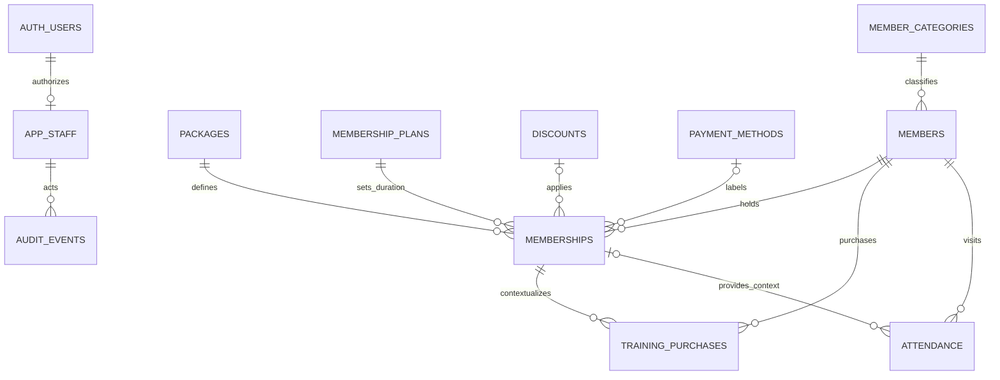

# Supabase data model draft

> September 29 update: the schema foundation is now applied to **The Community Fitness's Database** (`axbfwmrrxsgzevvqshdu`). The historical draft below is superseded by the executable migration and mappings in [Supabase implementation](../supabase/README.md). There are 12 tables (11 original + `member_codes`), RLS-protected reads and closed application writes. No member/account/attendance records were uploaded. The frontend is still local.

Updated: 2026-09-23. The original eight-table design now has three additive local collections for plans, discounts and training purchases. It is not executed SQL or an applied migration. A target Supabase project and final business policies are still pending. See [Prototype](PROTOTYPE.md) for the adapter boundary and live implementation work.

## Relationships

Member profiles describe people. Membership rows describe individual subscriptions/renewals. Attendance rows describe daily presence. Authentication users describe application operators, not gym members.

## Proposed tables

| Table | Proposed fields | Purpose |
|---|---|---|
| `member_categories` | `id`, `code`, `label`, `enabled` | Five selectable categories: VIP Customer, Customer, Student, Staff/Employee, Guest. Historical unknown remains disabled/unresolved |
| `members` | `id`, `member_code`, `previous_codes`, `full_name`, `category_id`, optional `contact_phone`, `date_of_birth`, `student_id`, `remark`, `archived_at`, timestamps | Stable member identity; profile fields remain proposals |
| `packages` | `id`, `code`, `label`, `access_notes`, `allows_training`, `enabled`, timestamps | Gym and Swimming Pool Only; future admin additions. Duration belongs to the selected plan |
| `membership_plans` | `id`, `label`, `duration_months`, `enabled` | 1, 3, 6 and 12 calendar-month terms |
| `discounts` | `id`, `label`, `percentage`, `enabled`, timestamps | Separate optional benefit: Condo 50%, Student 20%, Student 50%; admin extensions |
| `training_purchases` | `id`, `member_id`, `membership_id`, `service_type`, `sessions`, `duration_months`, `start_date`, `end_date`, timestamps, void metadata | PT purchase separate from membership; usage tracking is not yet implemented |
| `payment_methods` | `id`, `code`, `label`, `enabled` | Payment category labels; options not yet supplied |
| `memberships` | `id`, `member_id`, `package_id`, `package_snapshot`, `plan_id`, `plan_snapshot`, nullable `discount_id`, nullable `discount_snapshot`, `member_code_snapshot`, `member_category_snapshot`, `start_date`, nullable `calculated_end_date`, nullable `override_end_date`, nullable `payment_method_id`, nullable `payment_method_label_snapshot`, nullable `voucher_reference`, `remark`, `voided_at`, timestamps | Subscription/renewal history without amounts |
| `attendance` | `id`, `member_id`, nullable `membership_id`, `attendance_date`, `checked_in_at`, `member_code_snapshot`, `member_category_snapshot`, `checked_in_by`, correction metadata | One daily presence; membership link supplies context, not identity |
| `app_staff` | `user_id` referencing `auth.users`, `display_name`, `role_code`, `enabled`, timestamps | Trusted administrator/reception access; final permission matrix pending |
| `audit_events` | `id`, `actor_user_id`, `entity_type`, `entity_id`, `action`, `changes`, `reason`, `occurred_at` | Server-recorded changes, overrides, archive/restore and attendance corrections |

Business rows also carry `created_by`/`updated_by` actor references where applicable. Overrides carry `overridden_by`/`overridden_at`/`override_reason`. Legacy imports need compact `source_reference` metadata including sheet, row and import batch reference.

IDs are proposed native UUIDs generated in the database. They are not name slugs, phone numbers, or vouchers. At this gym's initial scale they avoid extension dependencies; engine version/generation options must be verified against the actual project before SQL is authored. `member_code` follows VC01/C001/S001/E001/G01 prefixes. Allocate codes transactionally per category and reserve former codes permanently; production may normalize aliases into a member-code history table to enforce cross-current/previous uniqueness. Local arrays are not multi-device allocation protection.

Package snapshots preserve labels, facilities and training eligibility. Plan snapshots preserve duration and discount snapshots preserve the selected label/percentage for that subscription. Payment labels and member category snapshots preserve historical meaning after catalogue/profile edits. Snapshots are captured by the trusted write path, not arbitrary client input. Unknown historical values remain unknown.

Guests share the same members table and have no package/plan until converted.
A Guest conversion updates category/code, retains the UUID/former G-code and
creates membership plus optional training purchase atomically. Guest trial
presence has a null membership reference. Local trial validity begins on first
check-in; later-day trial check-ins are blocked. Any future reissue needs an
explicit grant/history model rather than deleting the first visit.

Training is optional for Gym-eligible packages and excluded for Swimming Pool
Only. PT 5/10 sessions last 1 month, 20 last 2, 50 last 5. The start is the
membership start, confirmed by the user. Training expiry is independent of the
membership end override; it cannot confer Gym membership validity. Purchases
are separate records and no session-use table is implemented yet.

Catalogue status changes never rewrite purchased snapshots.
Server writes must revalidate active package/plan/discount and package training
eligibility even if a form was opened while those records were still active.

## Date and status logic

- Membership dates use PostgreSQL `date`; operator/check-in/audit timestamps use `timestamptz`.
- Calculate a target year/month from the original start plus all plan months, then use `min(original_day, target_month_final_day)`. Do not repeatedly add one clipped month.
- `effective_end_date = override_end_date` when present; otherwise `calculated_end_date`.
- For new memberships, require an active plan and calculate its calendar end in the database and form preview. Admin may override with a reason. Unknown historical plans remain unknown.
- For historical imports, preserve explicit recorded expiry dates. Do not recalculate them using today's catalogue. Missing starts/ends require review; do not insert invented dates.
- A start/duration edit recalculates the baseline and explicitly resolves any existing override. Record both the data change and override change in one transaction.
- Overrides must not precede the start date. Creation, edit and removal of overrides require authorization and history.
- Active/upcoming/expired/unknown are derived from date rules and valid records, not a permanent `is_active` checkbox. End-date inclusivity is pending; do not finalize comparisons until it is resolved.
- Overlapping memberships must not duplicate profile counts. Whether overlaps are allowed, and which membership provides check-in context, needs a defined rule before implementation.
- Archived profile status and membership validity are different. Archive should retain history under the proposed deletion model.

## Attendance integrity

- Proposed unique constraint: `(member_id, attendance_date)`; verify the one-presence-per-day business rule during screen review.
- Canonical live attendance day is derived by the database from the check-in timestamp in `Asia/Rangoon`, not the browser clock or UTC date.
- Repeated/concurrent requests return the existing attendance row. The losing request must not overwrite the original timestamp/actor or leave the UI in a failed state.
- A database-confirmed successful insert or existing check-in is required before the UI reports success.
- Membership linkage is optional to permit later Daypass/unknown context; allowing such a check-in remains a policy decision, not an automatic allowance.
- If `membership_id` is supplied, the database write path must verify it belongs to the same member.
- Staff/customer category snapshots come from canonical records at the check-in time. They must not be client-selected.
- If corrections are added, preserve who/when/why. A voided daily row can be restored under the same unique key instead of creating a second daily presence. Counts/export distinguish valid and voided records.
- Do not expose backdated entry until its authorization and semantics are defined.

## Keys, constraints and indexes

- Unique member code and catalogue codes. Full names, phones and voucher references are not unique.
- Trim/validate names and treat phones, student IDs and vouchers as strings; preserve leading zeroes.
- Index foreign keys used for joins/RLS. The attendance member/date unique index covers member history; add a date/member index for daily lists and period analytics.
- Index memberships by member/start date; add expiry/filter indexes only when query patterns justify them.
- Use `ON DELETE RESTRICT` for member history references. Catalogue rows should be disabled instead of removed once referenced.
- Avoid destructive cascades from member deletion to attendance/memberships. Final deletion/archive behavior must match the user's CRUD requirements.

## Access controls

- Supabase Auth handles application login; use trusted `app_staff` membership/roles for authorization. Gym member categories do not confer app permissions.
- RLS applies to every exposed business table. A signed-in user must also be an enabled, authorized app staff member; `TO authenticated` alone is insufficient.
- Explicit Data API grants and role-aware SELECT/INSERT/UPDATE rules are needed. Verify the target project's Data API settings; do not assume new tables are automatically exposed.
- End overrides/catalogue/role management require admin authorization through a controlled write path. UI-hidden controls alone do not enforce this.
- `app_staff` role/enabled changes cannot be self-service for reception users. Membership writes and overrides produce an audit event atomically.
- Audit writes are server-controlled. Operators cannot rewrite actor IDs, snapshots or audit history.
- Prefer security-invoker operations. If privileged routines are needed, scope their execution privileges and verify authorization; do not add security-definer simply to bypass permission errors.
- Views used for analysis/export must obey the caller's RLS (`security_invoker` where supported).
- Frontend uses the project URL and publishable key. Privileged secret/service-role keys remain server-side.

The exact role/action matrix is proposed in `SCREEN_FLOW.md`; choose it before policies are implemented. A general gym staff login does not get database-wide member access by default.

## Excel migration and export

- Existing name-derived browser member IDs need explicit reconciliation to stable IDs. Similar names or repeated vouchers cannot authorize automatic merges.
- The source `Member No.` is probably a voucher reference. Preserve it as nonunique text while its meaning is confirmed.
- Legacy membership workbook includes repeated/shared references, cancellation/balance/transfer remarks and expiry dates in several columns/remarks. Preserve source context and review uncertain rows.
- User-confirmed three-month package meaning does not justify rewriting inconsistent historical expiry dates.
- Do not automatically upload source rows or browser data to a live project. Select the target and review mappings first.
- Export normalized Members/Memberships/Attendance/Training sheets with matching stable member codes, typed dates, period/filter metadata and no money fields.
- Use one consistent authorized dataset/snapshot for an export, account for pagination, and reconcile valid attendance counts. Joins must not multiply attendance by subscription history.
- Database backup/restore is separate from Excel reporting and must be selected according to the eventual deployment plan.

## Local schema upgrade

The local storage key remains unchanged with payload schema_version 2. Upgrade
adds the three collections, retires earlier package options, preserves historical
dates/snapshots and keeps unknown categories unresolved. Known category profiles
get prefix codes with previous IDs retained. Before the first write, raw old data
is backed up under the original key plus `:before-concept-v2`. No member rows are
merged or discarded and no source Excel is imported by this upgrade.

## Implementation verification

1. Calendar examples in the brief, leap year, multi-month month-end clipping, override/edit/reset history, and date-boundary policy.
2. Two simultaneous check-ins and a lost-response retry create one daily presence; Myanmar midnight produces the correct local day.
3. Unauthorized/disabled/unregistered users are denied; reception/admin get only the selected operations. Test direct API writes, not just UI visibility.
4. Profile edits and catalogue status changes retain past membership snapshots; archive/restore retains attendance; history joins do not inflate metrics.
5. Excel exported row counts and member links reconcile to the same filtered authorized data, including pagination and archive/correction rules. Verify Guest conversion keeps old attendance category/code snapshots and PT exports reconcile to purchases.
6. Run Supabase advisors and check allow/deny cases before considering the connection ready for real use.

## Current primary references

- [Supabase RLS](https://supabase.com/docs/guides/database/postgres/row-level-security): database row access and client grants.
- [Securing the Data API](https://supabase.com/docs/guides/api/securing-your-api): exposed schemas and grants.
- [Data API default privilege change](https://supabase.com/changelog/45329-breaking-change-tables-not-exposed-to-data-and-graphql-api-automatically): new tables may need explicit exposure.
- [PostgreSQL date/time types](https://www.postgresql.org/docs/current/datatype-datetime.html): date and timestamp storage.

Related: [Project brief](PROJECT_BRIEF.md), [Screen flow](SCREEN_FLOW.md).

## Current reporting refinements (September 21)

`service_type` is canonical `pt` for all new training purchases; Rehab is not a second product. Historical values are preserved, while the UI/export uses PT. Catalogue definitions are immutable after creation; only enabled status changes.

Staff 25th-to-25th reporting uses inclusive date bounds at both ends, confirmed by the user. Do not duplicate the attendance row on the shared 25th. Member UUID/day uniqueness still applies. Exports are compact operational reports, not lossless backups; internal IDs, source references and snapshots remain stored. See [Metrics](METRICS.md).
## September 22 update

Custom Analytics date ranges, Analytics-only export, same-day saved check-in time corrections with reason/original time/audit, red-neutral UI, and date-column 1/0 attendance export are implemented. The selected date range includes its endpoints and may include today (partial-day notice). Matrix exports include zero-visit members; 0 means no matching recorded visit. Underlying attendance remains row-based and unique per member/day. Live authorization and date/backdated-entry policies are still pending. See [current requirements](PROJECT_BRIEF.md#september-22-ui-and-reporting-supersedes-earlier-reporting-details).

## September 23 — current access and UI (supersedes earlier restrictions)

- Local login UI/role flow was explicitly selected; Supabase is still unconnected.
  First use creates one Super Admin (no default credentials). Super Admin can
  create/delete Admin accounts and edit saved non-legacy packages/discounts.
  Both roles share all other current member, attendance, catalogue create/status,
  analytics and export actions. Historical catalogue definitions remain preserved.
- Accounts are separate from gym records at `community-fitness:local-accounts:v1`.
  Passwords use salted PBKDF2-SHA256 (210,000 iterations), not plaintext.
  Sessions are per-tab sessionStorage, expire after eight hours, and deleted
  accounts lose their session on the next check. Login is a local workflow,
  NOT a trusted authorization boundary; browser storage is user-editable.
  Clearing storage loses local accounts/data. There is no local password recovery.
  Do not use this as protection for real member data on shared devices.
- Catalogue editing checks the local Super Admin role and stale updated timestamp,
  logs before/after changes, and leaves existing membership/PT snapshots untouched.
  Membership creation and attendance/audit actor IDs identify the signed-in account.
  Deleted account audit history and member data are retained.
- Dashboard has five cards in one desktop row. New / Renew counts valid membership
  transactions **saved today in Myanmar time**, not membership start dates.
  First membership is New; subsequent memberships are Renew. Profile-only/Guest
  creation does not increment it. Two saved memberships for a person count twice.
  Drilldown shows type, person, package/plan and save time. Narrow screens scroll
  the same card row horizontally.
- Page headers use only an icon and heading (functional controls remain).
  Sidebar uses the supplied original PNG on a light gradient in both themes.
  Student ID input/detail appears only for Student; previously stored values
  are retained when changing category.
- Check-in confirmation offers an optional same-day Myanmar time; blank uses now.
  Invalid/future times are rejected. Existing presence is never overwritten by a
  repeated check-in. Manual entries retain recorded-at time and time-source.
- Saved check-in time correction is reached from an already-checked-in dialog
  or Member profile → Attendance history → Edit time. Reason, same-date constraint,
  original timestamp, stale-edit rejection and before/after audit are retained.
- Analytics no longer includes the reconnect list or attendance-record table.
  Charts, custom dates, metrics and Analytics-only Excel export remain.
