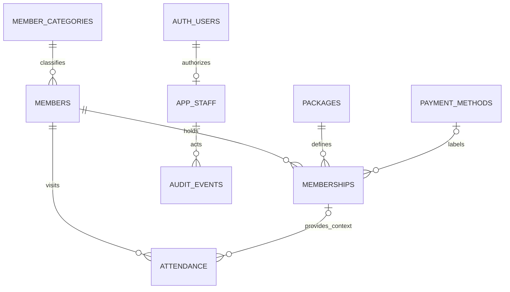

# Supabase data model draft

Updated: 2026-09-18. The eight-table design is used by the fictional local UI prototype. It is not executed SQL or an applied migration. A target Supabase project and final business policies are still pending. See [Prototype](PROTOTYPE.md) for the adapter boundary and live implementation work.

## Relationships

Member profiles describe people. Membership rows describe individual subscriptions/renewals. Attendance rows describe daily presence. Authentication users describe application operators, not gym members.

## Proposed tables

| Table | Proposed fields | Purpose |
|---|---|---|
| `member_categories` | `id`, `code`, `label`, `enabled` | Configurable customer/student/staff classification; an explicit unknown category for unresolved legacy data |
| `members` | `id`, `member_code`, `full_name`, `category_id`, optional `contact_phone`, `date_of_birth`, `student_id`, `remark`, `archived_at`, timestamps | Stable member identity; profile fields remain proposals |
| `packages` | `id`, `code`, `label`, nullable `duration_months`, nullable access-time bounds, nullable access notes, `enabled`, timestamps | Selectable Gym membership definitions; duration/access unknown stays unknown |
| `payment_methods` | `id`, `code`, `label`, `enabled` | Payment category labels; options not yet supplied |
| `memberships` | `id`, `member_id`, `package_id`, `package_snapshot`, `member_category_snapshot`, `start_date`, nullable `calculated_end_date`, nullable `override_end_date`, nullable `payment_method_id`, nullable `payment_method_label_snapshot`, nullable `voucher_reference`, `remark`, `voided_at`, timestamps | Subscription/renewal history without amounts |
| `attendance` | `id`, `member_id`, nullable `membership_id`, `attendance_date`, `checked_in_at`, `member_category_snapshot`, `checked_in_by`, correction metadata | One daily presence; membership link supplies context, not identity |
| `app_staff` | `user_id` referencing `auth.users`, `display_name`, `role_code`, `enabled`, timestamps | Trusted administrator/reception access; final permission matrix pending |
| `audit_events` | `id`, `actor_user_id`, `entity_type`, `entity_id`, `action`, `changes`, `reason`, `occurred_at` | Server-recorded changes, overrides, archive/restore and attendance corrections |

Business rows also carry `created_by`/`updated_by` actor references where applicable. Overrides carry `overridden_by`/`overridden_at`/`override_reason`. Legacy imports need compact `source_reference` metadata including sheet, row and import batch reference.

IDs are proposed native UUIDs generated in the database. They are not name slugs, phone numbers, or vouchers. At this gym's initial scale they avoid extension dependencies; engine version/generation options must be verified against the actual project before SQL is authored. `member_code` is a separate readable unique string, with its format still to be chosen.

Package snapshots preserve the label, duration, access times and access notes agreed for that subscription. Payment labels and member category snapshots preserve historical meaning after catalogue/profile edits. Snapshots are captured by the trusted write path, not arbitrary client input. Unknown historical values remain unknown.

Only confirmed Gym membership definitions belong in the initial `packages` catalogue. PT, Daypass and Class Rental are distinct services; keep unresolved historical service rows as source remarks/context rather than silently manufacturing subscriptions. Later PT purchases/usage and promotional Daypass grants can reference the same `member_id` without changing membership identity. Dedicated service tables are extensions, not initial confirmed features.

## Date and status logic

- Membership dates use PostgreSQL `date`; operator/check-in/audit timestamps use `timestamptz`.
- Calculate a target year/month from the original start plus all package months, then use `min(original_day, target_month_final_day)`. Do not repeatedly add one clipped month.
- `effective_end_date = override_end_date` when present; otherwise `calculated_end_date`.
- For new known-duration memberships, calculate the end in the database and show the same result in the form preview. Permit an explicit admin end date when duration is unknown, with a reason.
- For historical imports, preserve explicit recorded expiry dates. Do not recalculate them using today's catalogue. Missing starts/ends require review; do not insert invented dates.
- A start/duration edit recalculates the baseline and explicitly resolves any existing override. Record both the data change and override change in one transaction.
- Overrides must not precede the start date. Creation, edit and removal of overrides require authorization and history.
- Active/upcoming/expired/unknown are derived from date rules and valid records, not a permanent `is_active` checkbox. End-date inclusivity is pending; do not finalize comparisons until it is resolved.
- Overlapping memberships must not duplicate profile counts. Whether overlaps are allowed, and which membership provides check-in context, needs a defined rule before implementation.
- Archived profile status and membership validity are different. Archive should retain history under the proposed deletion model.

## Attendance integrity

- Proposed unique constraint: `(member_id, attendance_date)`; verify the one-presence-per-day business rule during screen review.
- Canonical live attendance day is derived by the database from the check-in timestamp in `Asia/Rangoon`, not the browser clock or UTC date.
- Repeated/concurrent requests return the existing attendance row. The losing request must not overwrite the original timestamp/actor or leave the UI in a failed state.
- A database-confirmed successful insert or existing check-in is required before the UI reports success.
- Membership linkage is optional to permit later Daypass/unknown context; allowing such a check-in remains a policy decision, not an automatic allowance.
- If `membership_id` is supplied, the database write path must verify it belongs to the same member.
- Staff/customer category snapshots come from canonical records at the check-in time. They must not be client-selected.
- If corrections are added, preserve who/when/why. A voided daily row can be restored under the same unique key instead of creating a second daily presence. Counts/export distinguish valid and voided records.
- Do not expose backdated entry until its authorization and semantics are defined.

## Keys, constraints and indexes

- Unique member code and catalogue codes. Full names, phones and voucher references are not unique.
- Trim/validate names and treat phones, student IDs and vouchers as strings; preserve leading zeroes.
- Index foreign keys used for joins/RLS. The attendance member/date unique index covers member history; add a date/member index for daily lists and period analytics.
- Index memberships by member/start date; add expiry/filter indexes only when query patterns justify them.
- Use `ON DELETE RESTRICT` for member history references. Catalogue rows should be disabled instead of removed once referenced.
- Avoid destructive cascades from member deletion to attendance/memberships. Final deletion/archive behavior must match the user's CRUD requirements.

## Access controls

- Supabase Auth handles application login; use trusted `app_staff` membership/roles for authorization. Gym member categories do not confer app permissions.
- RLS applies to every exposed business table. A signed-in user must also be an enabled, authorized app staff member; `TO authenticated` alone is insufficient.
- Explicit Data API grants and role-aware SELECT/INSERT/UPDATE rules are needed. Verify the target project's Data API settings; do not assume new tables are automatically exposed.
- End overrides/catalogue/role management require admin authorization through a controlled write path. UI-hidden controls alone do not enforce this.
- `app_staff` role/enabled changes cannot be self-service for reception users. Membership writes and overrides produce an audit event atomically.
- Audit writes are server-controlled. Operators cannot rewrite actor IDs, snapshots or audit history.
- Prefer security-invoker operations. If privileged routines are needed, scope their execution privileges and verify authorization; do not add security-definer simply to bypass permission errors.
- Views used for analysis/export must obey the caller's RLS (`security_invoker` where supported).
- Frontend uses the project URL and publishable key. Privileged secret/service-role keys remain server-side.

The exact role/action matrix is proposed in `SCREEN_FLOW.md`; choose it before policies are implemented. A general gym staff login does not get database-wide member access by default.

## Excel migration and export

- Existing name-derived browser member IDs need explicit reconciliation to stable IDs. Similar names or repeated vouchers cannot authorize automatic merges.
- The source `Member No.` is probably a voucher reference. Preserve it as nonunique text while its meaning is confirmed.
- Legacy membership workbook includes repeated/shared references, cancellation/balance/transfer remarks and expiry dates in several columns/remarks. Preserve source context and review uncertain rows.
- User-confirmed three-month package meaning does not justify rewriting inconsistent historical expiry dates.
- Do not automatically upload source rows or browser data to a live project. Select the target and review mappings first.
- Export proposed normalized Members/Memberships/Attendance sheets with matching stable member codes, typed dates, period/filter metadata and no money fields.
- Use one consistent authorized dataset/snapshot for an export, account for pagination, and reconcile valid attendance counts. Joins must not multiply attendance by subscription history.
- Database backup/restore is separate from Excel reporting and must be selected according to the eventual deployment plan.

## Implementation verification

1. Calendar examples in the brief, leap year, multi-month month-end clipping, override/edit/reset history, and date-boundary policy.
2. Two simultaneous check-ins and a lost-response retry create one daily presence; Myanmar midnight produces the correct local day.
3. Unauthorized/disabled/unregistered users are denied; reception/admin get only the selected operations. Test direct API writes, not just UI visibility.
4. Profile/catalogue edits retain past membership snapshots; archive/restore retains attendance; history joins do not inflate metrics.
5. Excel exported row counts and member links reconcile to the same filtered authorized data, including pagination and archive/correction rules.
6. Run Supabase advisors and check allow/deny cases before considering the connection ready for real use.

## Current primary references

- [Supabase RLS](https://supabase.com/docs/guides/database/postgres/row-level-security): database row access and client grants.
- [Securing the Data API](https://supabase.com/docs/guides/api/securing-your-api): exposed schemas and grants.
- [Data API default privilege change](https://supabase.com/changelog/45329-breaking-change-tables-not-exposed-to-data-and-graphql-api-automatically): new tables may need explicit exposure.
- [PostgreSQL date/time types](https://www.postgresql.org/docs/current/datatype-datetime.html): date and timestamp storage.

Related: [Project brief](PROJECT_BRIEF.md), [Screen flow](SCREEN_FLOW.md).
