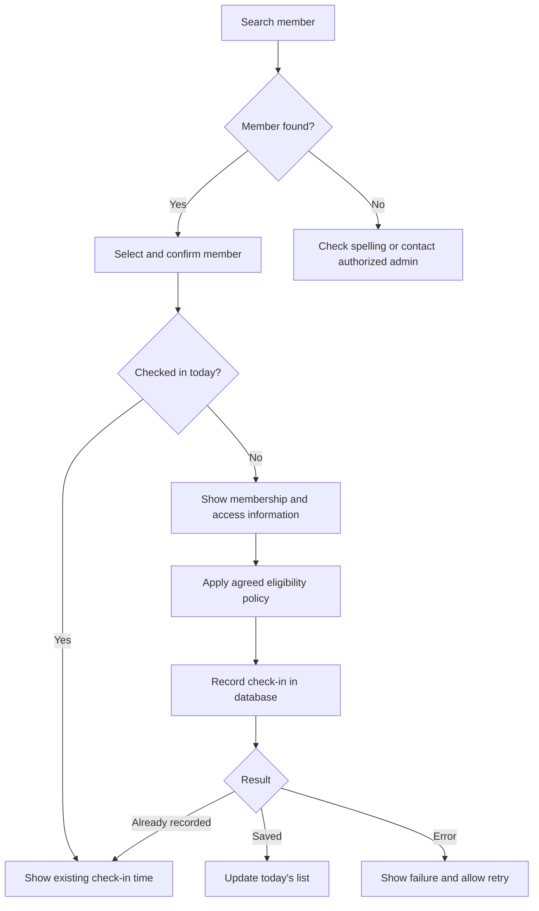

# Screen flow draft

Updated: 2026-09-18. An interactive prototype now implements the screen proposals with fictional browser-local data. Permissions and unresolved business policies remain proposals; see [Prototype](PROTOTYPE.md).

## Navigation

| Page | အဓိကလုပ်ဆောင်ချက် |
|---|---|
| Dashboard | Prototype landing page; today counts၊ attendance trend၊ category breakdown၊ expiry follow-up |
| Attendance | Reception အတွက် default landing page; search + check-in + today list |
| Members | Search/filter list၊ member detail၊ add/edit/archive proposal |
| Analytics | Daily trend၊ period totals၊ category breakdown၊ individual monthly calendar |
| Settings | Admin package definitions၊ payment method categories၊ staff access settings |

Excel export ကို Members/Analytics ရဲ့ သက်ဆိုင်ရာ view မှာထားမယ်။ Data import လိုသေးရင် Admin workflow အဖြစ်သီးခြားထားမယ်။ Legacy import strategy ကို အတည်မပြုရသေးဘူး။

## Reception attendance page

```text
The Community Fitness                         Myanmar date / staff name

[Name, phone or member code ကိုရှာပါ.................................]

Search results
Member code / Name / Category / Package / End Date / Today's check-in
---------------------------------------------------------------
သက်ဆိုင်သူကိုရွေး -> member အတည်ပြု -> [Check in]

Today's attendance                         [Name/category filter]
Time / Member code / Name / Category / Membership status
```

Names တူနေရင် member code နဲ့ contact information ကိုကြည့်ပြီး ရွေးမယ်။ Search result တစ်ခုတည်းဖြစ်နေလည်း လူမှန်ကိုရွေးပြီးမှ check-in လုပ်မယ်။ Check-in button ကို keyboard နဲ့သုံးလို့ရပြီး ဖုန်းမှာ tap လုပ်ရလွယ်တဲ့အရွယ်ထားမယ်။



Successful database write ရမှ Saved ပြမယ်။ Loading/error/empty states ကိုခွဲပြမယ်။ Expired၊ Unknown၊ Upcoming membership တွေကိုရှင်းပြမယ်; အဲဒီ status အတွက် allow/block policy ကို user နဲ့ဆက်ညှိမယ်။ သတ်မှတ်ချိန်ပြင်ပလာရင် information ပြတာနဲ့ hard-block လုပ်တာကိုလည်း ဆက်ဆုံးဖြတ်မယ်။ Offline support မအတည်ပြုရသေးဘူး။

တစ်နေ့တစ် attendance proposal အရ already checked-in ဖြစ်ရင် အချိန်အဟောင်းကိုပြပြီး duplicate မထည့်ဘူး။ Network retry/တခြား device မှ check-in က database uniqueness နဲ့ existing row ကိုပြန်ယူတဲ့ပုံစံသုံးမယ်။

## Member detail

- Header: member code၊ name၊ category၊ membership status နဲ့ today attendance။
- Profile: အတည်ပြုထားတဲ့ fields; အခု draft က brief ရဲ့ proposed fields ဖြစ်တယ်။
- Membership: current/upcoming packages၊ start/end dates၊ payment method၊ voucher reference၊ renew history။
- Attendance: month selector၊ ရောက်လာတဲ့နေ့တွေပြတဲ့ calendar၊ month total နဲ့ recent visits။
- Remark: legacy special entries နဲ့ admin notes။

PT information က Gym membership status နဲ့ သီးခြားပြမယ့် service information ဖြစ်တယ်။ PT session tracking ထည့်မလားဆိုတာ မအတည်ပြုရသေးဘူး။

## Admin workflows

Add member: proposed profile form -> review potential duplicates -> save stable ID -> optionally add membership.

Add/renew membership: member ရွေး -> package ရွေး -> manual start -> calculated end preview -> payment method/voucher/remark -> optional admin end override with reason -> save a new history record.

Package duration မသတ်မှတ်ရသေးရင် form ကမတွက်နိုင်ကြောင်းပြမယ်။ Duration အတည်ပြုခြင်း သို့မဟုတ် admin က explicit end date သတ်မှတ်ခြင်း လိုအပ်မယ်။ Historical expiry ကို automatic preview နဲ့အစားမထိုးဘူး။

Archive proposal: member profile ကို archive လုပ် -> default search မှဖယ် -> past attendance/memberships ကိုထိန်း -> restore လုပ်နိုင်။ Prototype ထဲမှာစမ်းနိုင်ပြီ; live permissions နဲ့ final CRUD policy ကိုဆက်ညှိမယ်။

## Permissions proposal

| Action | Reception proposal | Admin proposal |
|---|---|---|
| Search/profile/current membership | Read | Read |
| Today check-in | Create once/member/day | Create once/member/day |
| Member profile CRUD | မသတ်မှတ်ရသေး | Manage |
| Membership/renewal | မသတ်မှတ်ရသေး | Manage |
| End Date override | No | Yes, with history |
| Attendance correction/backdate | မသတ်မှတ်ရသေး | မသတ်မှတ်ရသေး |
| Analytics/export | မသတ်မှတ်ရသေး | Yes |
| Packages/payment methods/staff roles | No | Manage |

Gym staff member category က application Reception/Admin permission role နဲ့မတူပါဘူး။ UI controls နဲ့ database permissions နှစ်ခုလုံးမှာ access ကိုတူအောင်ထိန်းမယ်။

## Analytics draft

Today count၊ period attendance trend နဲ့ category chart ကိုအရင်ပြမယ်။ Member profile ကိုနှိပ်ရင် individual monthly calendar သို့ရောက်မယ်။ Daypass/PT ဝယ်ယူမှုကို ordinary attendance count နဲ့ မရောရဘူး။

Zero presence နဲ့ data မရသေးခြင်း/loading/error ကိုမတူတဲ့ states အဖြစ်ပြမယ်။ Rates၊ New/Renew monthly totals နဲ့ retention ကို definitions မရှင်းသေးလို့ initial confirmed metrics အဖြစ်မသတ်မှတ်သေးဘူး။

Related: [Project brief](PROJECT_BRIEF.md), [Data model](DATA_MODEL.md).
